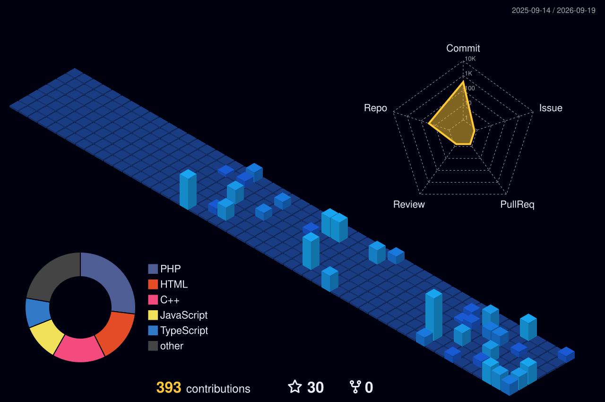

<p align="center">
  
</p>

<p align="center">
  
</p>

<h3 align="center">Hi 👋, welcome to my profile</h3>

<p align="center">
  
</p>

<p align="center">
  <a href="https://www.linkedin.com/in/muhammad-furqan-228807304/" target="_blank"></a>
  <a href="https://github.com/furqanzubair209-cell" target="_blank"></a>
  <a href="https://furqannewportfolio.netlify.app/" target="_blank"></a>
  <a href="https://www.upwork.com/freelancers/~016a10d73534b30cfe" target="_blank"></a>
  <a href="https://www.fiverr.com/furqan191005" target="_blank"></a>
  <a href="mailto:furqanzubair209@gmail.com"></a>
</p>

<p align="center">
  
</p>

<br>

## 🧑‍💻 About Me

```yaml
name: Muhammad Furqan
role: Frontend Software Engineer | AI/ML & Full-Stack Developer
location: Lahore, Pakistan

what_i_do:
  - Build responsive, production-ready frontend interfaces
  - Develop AI/ML pipelines, intelligent agents & automation workflows
  - Ship full-stack apps across React, Node.js, and MySQL/Prisma

currently:
  - 🎓 Pursuing BS Computer Science at The Superior University, Lahore (2024–2028) · CGPA 3.50/4.00
  - 🧠 Frontend AI Engineer Intern @ FlyRank AI
  - 💼 Freelance Software Engineer on Upwork & Fiverr
  - 🌱 Leveling up in NLP, Deep Learning & Cloud technologies

passionate_about:
  - 🤖 AI/ML & intelligent agents
  - 🖥️ Full-stack & frontend engineering
  - ⚙️ Workflow automation (n8n)
  - 🧩 Building things that think

open_to:
  - Internships & freelance software engineering projects
  - Full-stack / Frontend / AI-ML collaborations
  - Technical discussions & mentorship
```

📫 Reach me at **furqanzubair209@gmail.com**

---

## 🛠️ Tech Stack

<p align="center">
  <b>Languages</b><br>
  
  
  
  
  
  
</p>

<p align="center">
  <b>Frontend</b><br>
  
  
  
  
  
  
  
</p>

<p align="center">
  <b>Backend & Databases</b><br>
  
  
  
  
  
  
  
</p>

<p align="center">
  <b>AI / ML</b><br>
  
  
  
  
  
  
  
</p>

<p align="center">
  <b>Automation & Tools</b><br>
  
  
  
  
  
  
  
</p>

---

## 📌 Pinned Repositories

<p align="center">
  <a href="https://github.com/furqanzubair209-cell/furqanresumeanalyzer">
    
  </a>
  <a href="https://github.com/furqanzubair209-cell/furqanstore-mern">
    
  </a>
  <a href="https://github.com/furqanzubair209-cell/codeforge">
    
  </a>
</p>
<p align="center">
  <a href="https://github.com/furqanzubair209-cell/AI-Face-Mask-Detection">
    
  </a>
  <a href="https://github.com/furqanzubair209-cell/Student-Performance-Prediction">
    
  </a>
  <a href="https://github.com/furqanzubair209-cell/Student-Fee-Management-System">
    
  </a>
</p>

---

## 📊 GitHub Stats

<p align="center">
  
  
</p>

<p align="center">
  
</p>

---

## 🐍 Contribution Snake

<p align="center">
  <picture>
    <source media="(prefers-color-scheme: dark)" srcset="https://raw.githubusercontent.com/furqanzubair209-cell/furqanzubair209-cell/output/github-contribution-grid-snake-dark.svg">
    <source media="(prefers-color-scheme: light)" srcset="https://raw.githubusercontent.com/furqanzubair209-cell/furqanzubair209-cell/output/github-contribution-grid-snake.svg">
    
  </picture>
</p>

---

## 🏆 GitHub Trophies

<p align="center">
  
</p>

---

## 📊 Deep GitHub Insights

<p align="center">
  
  
</p>

<p align="center">
  
  
</p>

---
## 📉 Contribution Activity Graph

<p align="center">
  
</p>

---

## 📈 3D Contribution Graph

<p align="center">
  
</p>

---

## 🚀 Top 10 Projects

| # | Project | Description | Tech Stack | Links |
|---|---------|--------------|------------|-------|
| 1 | **CodeForge — LeetCode-Style DSA Platform** | C++ / DSA practice platform with 45 hand-crafted problems, a Monaco editor, and real g++ execution with Run/Submit modes. | React, TypeScript, Vite, Node.js, Express | [GitHub](https://github.com/furqanzubair209-cell/codeforge) • [LinkedIn Post](https://www.linkedin.com/posts/muhammad-furqan-228807304_webdevelopment-reactjs-typescript-activity-7501917967790669824-Eo05) |
| 2 | **Resume AI — Resume Analyzer & ATS Optimizer** | Analyzes resumes for ATS readiness, matches them to job descriptions, and suggests stronger bullet points. | React, JavaScript, PDF/DOCX Parsing | [GitHub](https://github.com/furqanzubair209-cell/furqanresumeanalyzer) • [Live Demo](https://furqanresumeanalyzer.netlify.app/) |
| 3 | **Furqan Chess** | Responsive two-player chess with time controls, move history, undo/redo, themes, and PGN export. | HTML5, CSS3, JavaScript | [GitHub](https://github.com/furqanzubair209-cell/furqan-chess/tree/main/Furqan-Chess-Game) • [Live Demo](https://furqan-chess-game.netlify.app/) |
| 4 | **FurqanStore — Multi-Vendor E-Commerce Marketplace** | Full-stack marketplace modernized from a legacy PHP/MySQL app; Customer/Vendor/Admin/Super Admin roles, JWT auth, vendor earnings, real-time inventory, and Socket.IO notifications. Fixed security issues like CORS misconfig and stock race conditions. *(In progress)* | React, TypeScript, Node.js, Express, Prisma, MySQL | [GitHub](https://github.com/furqanzubair209-cell/furqanstore-mern) • [LinkedIn Post](https://www.linkedin.com/posts/muhammad-furqan-228807304_webdevelopment-fullstackdevelopment-react-activity-7504571385587920896-GKlL) |
| 5 | **Student Management System (Web-Based)** | Responsive admin/student portals with CGPA calculation and an analytics dashboard. | HTML5, CSS3, JavaScript, Chart.js | [GitHub](https://github.com/furqanzubair209-cell/student-management-system-pro) • [Live Demo](https://furqanstudentmanagementsystem.netlify.app/) |
| 6 | **AI-Powered Web Scraping Agent** | Autonomous agent that navigates websites, extracts structured data, filters results, and stores them. | Python, BeautifulSoup, PEAS | [GitHub](https://github.com/furqanzubair209-cell/AI-powered-web-scraper-) • [LinkedIn Post](https://www.linkedin.com/posts/muhammad-furqan-228807304_artificialintelligence-webscraping-python-activity-7432496845735583744-qpcf) |
| 7 | **AI Face Mask Detection** | Real-time face mask detection using an OpenCV face detector and a MobileNetV2 classifier, with a Streamlit web app, image and webcam detection, confidence scores, and voice alerts. | Python, TensorFlow/Keras, OpenCV, MobileNetV2, Streamlit | [GitHub](https://github.com/furqanzubair209-cell/AI-Face-Mask-Detection) • [LinkedIn Post](https://www.linkedin.com/posts/muhammad-furqan-228807304_deeplearning-computervision-opencv-activity-7453713785787236352-2MrW) |
| 8 | **Student Performance Prediction** | End-to-end ML project predicting student exam scores from 6,607 records and 20 features; XGBoost with GridSearchCV tuning reached R² 0.914 (MAE 0.60). | Python, Pandas, Scikit-learn, XGBoost, Matplotlib, Seaborn | [GitHub](https://github.com/furqanzubair209-cell/Student-Performance-Prediction) • [LinkedIn Post](https://www.linkedin.com/posts/muhammad-furqan-228807304_datascience-machinelearning-python-activity-7453406241994977280-_y5x) |
| 9 | **Student Fee Management System** | C++ desktop app with 8 modules covering student records, fee structures, payments, dues, fines, receipts, reports, and backup/restore; built as a Spring 2026 team project. | C++, File Handling | [GitHub](https://github.com/furqanzubair209-cell/Student-Fee-Management-System) • [LinkedIn Post](https://www.linkedin.com/posts/muhammad-furqan-228807304_student-fee-management-system-activity-7460593620857999360-nAZ6) |
| 10 | **Personal Portfolio Website (Upgraded)** | Responsive portfolio showcasing education, skills, projects, and internship experience. | React 19, Typescript, Vite, Tailwind CSS 4, Framer Motion | [GitHub](https://github.com/furqanzubair209-cell/Muhammad-Furqan-Portfolio) • [Live Demo](https://furqannewportfolio.netlify.app/) |

📌 **See more projects** on my [GitHub](https://github.com/furqanzubair209-cell) and [LinkedIn](https://www.linkedin.com/in/muhammad-furqan-228807304/)

---

## 💼 Experience

**Frontend AI Engineer** — *FlyRank AI* (Internship · Jul 1 – Aug 31, 2026 · Remote)
- Develop responsive, mobile-friendly interfaces using modern frontend technologies and Tailwind CSS
- Build reusable UI components and e-commerce-style pages
- Use AI-assisted tools to support development, debugging, and testing

**Freelance Software Engineer** — *Upwork* (Aug 2026 – Present · Remote)
- Offer software development services across AI/ML, web development, and automation
- Work on prediction models, computer vision, intelligent agents, and n8n workflows

**Freelance Software Engineer** — *Fiverr* (Aug 2026 – Present · Remote)
- Build applications using React, JavaScript, Tailwind CSS, PHP, and MySQL
- Deliver Python-based ML, computer vision, scraping, and automation solutions

**Frontend Development Intern** — *CodeAlpha* (Internship · Aug 1 – Aug 31, 2026 · Remote)
- Built responsive, interactive web pages and maintainable frontend code

**Web Development and Designing Intern** — *Oasis Infobyte* (Internship · Jul 15 – Aug 15, 2026 · Remote)
- Built responsive interfaces using HTML, CSS, and vanilla JavaScript with cross-browser compatibility

**Independent Software Developer** (Sep 2024 – Present)
- Designed, developed, and released software tools, ML pipelines, and games across Python, C++, PHP, and JavaScript

**Home Tutor** (Part-Time · Sep 2023 – Present)
- Tutored students in Mathematics, Physics, and Computer Science

---

## 📜 Top 10 Certifications

| # | Certification | Issuer | Verify |
|---|----------------|--------|--------|
| 1 | Introduction to Responsible AI | Google Cloud Skills Boost | [Verify](https://www.skills.google/public_profiles/569b05a1-06f2-4934-9e6a-7ffe3d8487c8/badges/26266138?locale=pt_PT) |
| 2 | Introduction to Generative AI | Google Cloud Skills Boost | [Verify](https://www.skills.google/public_profiles/569b05a1-06f2-4934-9e6a-7ffe3d8487c8/badges/26244974) |
| 3 | Introduction to Data Science | Cisco Networking Academy | [Verify](https://www.credly.com/badges/5a3826db-a220-4470-8426-9a17cd105f3d/public_url) |
| 4 | Artificial Intelligence Fundamentals | IBM | [Verify](https://www.credly.com/badges/f7aa2d86-98b8-45c0-ba27-958fbec48053/public_url) |
| 5 | Claude with Anthropic API | Anthropic | [Verify](https://verify.skilljar.com/c/fiws6btf6aef) |
| 6 | AI Fluency: Framework & Foundations | Anthropic | [Verify](https://verify.skilljar.com/c/9irmywg3n7h3) |
| 7 | Claude Code 101 | Anthropic | [Verify](https://verify.skilljar.com/c/zfeu8py2orp4) |
| 8 | Claude 101 | Anthropic | [Verify](https://verify.skilljar.com/c/shgu6gyn969j) |
| 9 | AI Fluency for Students | Anthropic | [Verify](https://verify.skilljar.com/c/eaev74cqgwt8) |
| 10 | FlyRank AI Internship — Front-End AI Engineering | FlyRank AI | [Verify](https://internship.flyrank.ai/verify/FR-D11-EAABF-FA85A?first_name=Muhammad) |

📌 **See more certificates** on my [LinkedIn](https://www.linkedin.com/in/muhammad-furqan-228807304/)

---

## 🎓 Education

- **BS Computer Science** — The Superior University, Lahore (2024–2028, Expected) · CGPA: 3.50/4.00
- **Intermediate in Computer Science (ICS)** — Superior College, Lahore (2022–2024) · Grade A · 923/1200
- **Matriculation (Computer Science)** — Government High School Awan Town, Lahore (2020–2022) · Grade A+ · 1006/1100

---

## 🏆 Honors & Awards

- Character Mastery Certificate — CAKCCIS, The Superior University (Sep 2024)
- Half Scholarship Award — The Superior University (Jul 2024)
- Full Scholarship Award — Superior College (Sep 2022)

---

## 📫 Let's Connect

<p align="left">
  <a href="https://www.linkedin.com/in/muhammad-furqan-228807304/" target="_blank"></a>
  <a href="https://github.com/furqanzubair209-cell" target="_blank"></a>
  <a href="https://furqannewportfolio.netlify.app/" target="_blank"></a>
  <a href="https://www.upwork.com/freelancers/~016a10d73534b30cfe" target="_blank"></a>
  <a href="https://www.fiverr.com/furqan191005" target="_blank"></a>
  <a href="mailto:furqanzubair209@gmail.com"></a>
</p>

I'm open to internship opportunities, project collaborations, and technical discussions. Feel free to connect! 🚀

<p align="center">
  
</p>


